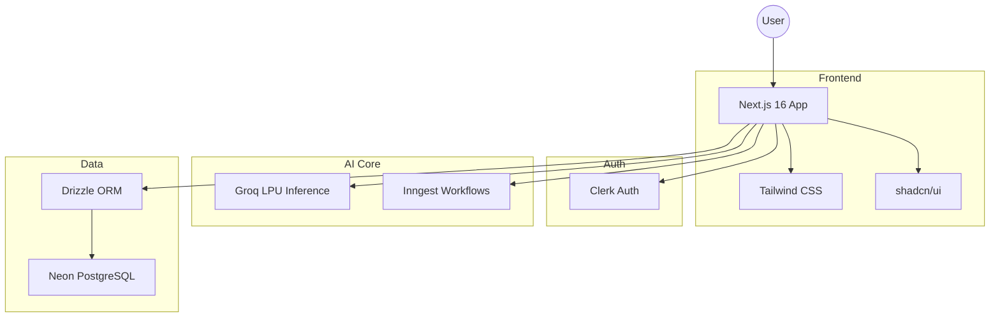
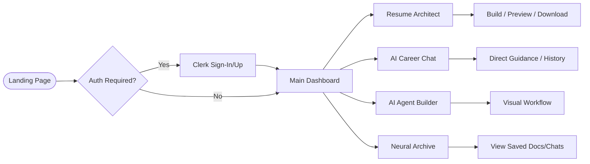

# 🚀 Saarthi — Autonomous AI Career Orchestration Platform

**Saarthi** is a state-of-the-art, AI-driven career orchestration platform designed to empower job seekers, software engineers, and professionals with neural resume architecture, AI mock interview rooms, personalized learning roadmaps, and intelligent career mentorship.

---

## ✨ Core Features & Platform Capabilities

### 🛠️ Neural Resume Architect & Intelligence
- **Dynamic Multi-Pane Workspace**: Built with `react-resizable-panels` for fluid multi-column editing, live diagnostics, and preview.
- **ATS Deep Breakdown**: Real-time score calculation across 4 dimensions: Resume Quality, Projects Strength, Skills Coverage, and Experience Impact.
- **Durable Cloud Archiving**: Automated PDF resume storage via AWS S3 and Neon PostgreSQL database synchronization.
- **Multi-Format Export**: High-quality PDF export (`jspdf-autotable`) and DOCX (`docx`).

### 🎙️ AI Mock Interview Room & Real-Time STT
- **Speech-to-Text Transcription**: Instant voice-to-text response parsing powered by Groq Whisper.
- **AI Recruiter Evaluation**: Dynamic interview question generation and detailed performance scorecard reports.

### 🤖 Intelligent AI Agents & Career Mentorship
- **AI Career Coach**: Interactive conversational wingman built on AWS Bedrock (Amazon Nova models) and Groq LPU engines.
- **Custom Agent Builder**: Interactive workflow for creating specialized career personas.
- **Multi-Tier Model Resilience**: Built-in fallback architecture seamlessly transitioning across primary models, lightweight LLMs, and Bedrock.

### 📚 Learning Roadmaps & Writing Studio
- **Dynamic Roadmap Generator**: Custom step-by-step career navigation for targeted tech roles.
- **AI Writing Studio**: Automated cover letter composer and professional career document archive.

### 🎨 Design System & Aesthetics
- **Sleek Glassmorphism**: Premium dark mode theme with HSL-tailored cyan/blue accents, dynamic blur overlays, and micro-animations.

---

## 🗺️ Visual Architecture

### 🏗️ System Architecture


### 🔄 User Flow


---

## 🛠️ Tech Stack & Infrastructure

### Frontend & Core
- **Framework**: [Next.js 16 (App Router)](https://nextjs.org/)
- **Runtime**: React 19, TypeScript 5
- **Styling & UI**: Tailwind CSS v4, Framer Motion, Radix UI Primitives, Lucide Icons

### Backend, AI & Data Layer
- **Auth**: [Clerk Authentication](https://clerk.dev/)
- **AI Inference**: AWS Bedrock Runtime (Amazon Nova Pro/Lite) & Groq LPU SDK
- **Cloud Storage**: AWS S3 Bucket Integration
- **Database**: Neon PostgreSQL with Drizzle ORM
- **Background Orchestration**: [Inngest Functions](https://www.inngest.com/)

---

## 🐳 Docker Support & Local Development

Saarthi includes a production-grade multi-stage `Dockerfile` (Node.js 22 Alpine, standalone server output, non-root user) and a local `docker-compose.yml` environment.

### 1. Build Production Docker Image
```bash
docker build -t saarthi .
```

### 2. Run Container Locally
```bash
docker run --env-file .env -p 3000:3000 saarthi
```
- **Application**: [http://localhost:3000](http://localhost:3000)
- **Healthcheck**: [http://localhost:3000/api/health](http://localhost:3000/api/health)

### 3. Run Development Stack (App + PostgreSQL)
```bash
docker compose up --build
```

---

## 🚀 Getting Started

### Prerequisites
- Node.js 20+
- Git & Docker (optional)
- API Keys for Clerk, Neon Postgres, Groq, AWS Bedrock/S3, and Inngest

### Installation

1. **Clone the repository**
   ```bash
   git clone https://github.com/divysaxena24/Saarthi.git
   cd Saarthi
   ```

2. **Install dependencies**
   ```bash
   npm install
   ```

3. **Configure Environment Variables**
   Copy `.env.example` to `.env` and fill in your credentials:
   ```bash
   cp .env.example .env
   ```

4. **Run Development Server**
   ```bash
   npm run dev
   ```

---

## ⚙️ CI/CD Pipeline

Continuous Integration is managed via GitHub Actions ([.github/workflows/ci.yml](file:///d:/DIVY/webDev/Projects/Saarthi/.github/workflows/ci.yml) & [.github/workflows/docker.yml](file:///d:/DIVY/webDev/Projects/Saarthi/.github/workflows/docker.yml)):
- **TypeScript Check**: `npx tsc --noEmit`
- **Next.js Production Build**: `npm run build`
- **Docker Image Build Verification**: `docker build` using GitHub Actions GHA cache.

---

## 🤝 Contributing

Contributions are welcome! Please open an issue or submit a pull request.

---

## 📄 License
Licensed under the MIT License.